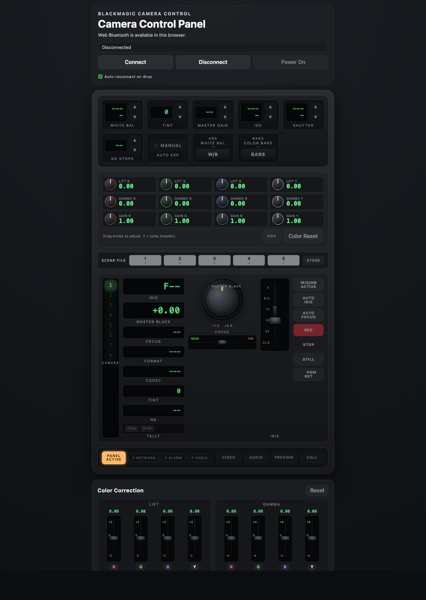
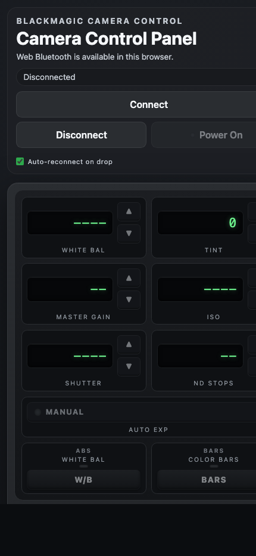
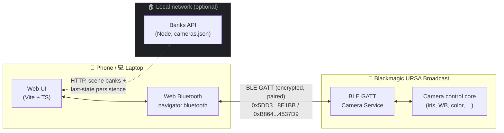

# ursa-bt

A mobile-first web control surface for **Blackmagic URSA Broadcast** cameras over **Bluetooth Low Energy**, built with Vite + TypeScript and the browser's [Web Bluetooth API](https://developer.mozilla.org/docs/Web/API/Web_Bluetooth_API).

The UI is modeled on the look and feel of a broadcast camera CCU panel: white-balance / tint / gain / shutter / iris / focus / ND, full lift–gamma–gain color correction, master black, audio levels, scene file banks, and tally readouts — all driven straight from a phone or laptop browser.

<p align="center">
  
</p>

<p align="center">
  
</p>

> ⚠️ This is a personal hobby project, not a Blackmagic product. It is not affiliated with or endorsed by Blackmagic Design.

## Status

- Primary target: **Android Chrome** over direct Web Bluetooth on a phone.
- Development host: **macOS Chrome** on `http://localhost` (Chrome treats localhost as a secure origin, so Web Bluetooth works there).
- First validated camera: **Blackmagic URSA Broadcast** (G1). Should be largely compatible with URSA Broadcast G2.
- iOS Safari / iPhone Chrome are **not** supported for direct Web Bluetooth — iOS browsers don't expose `navigator.bluetooth`. A bridge or REST API path is future work.

## Features

- Connect, pair, and reconnect to the camera over BLE; pair-PIN flow handled by the browser.
- Live status flags, tally indicators, recording state, codec / format / FPS readout.
- White balance + tint, gain, ISO, shutter angle, ND filter, exposure µs.
- Iris joystick, master black knob, focus fader.
- Lift / Gamma / Gain / Offset paint controls — both quick knobs and full RGB+Y vertical faders, plus contrast pivot/adjust, hue, saturation, luma mix.
- 5 scene file banks per camera with **STORE** workflow; the active scene dims when the panel state has diverged from the stored bank.
- Audio: dual input gain, mic, headphone, speaker, monitor mix; reset.
- Color settings (and other parameters not echoed by the camera) are persisted in an in-memory "current scene" and re-pushed to the camera on reconnect.
- Hold-to-engage `BARS` and `PGM RET` buttons styled after the unit.
- Optional Node-only banks API (no external database) for cross-device persistence.

## How control reaches the camera

The control path is **direct BLE between the phone/laptop and the camera** — no cloud, no internet hop. The optional banks API only stores scene presets and last-known state on disk over the local network.



> Web Bluetooth requires a secure origin and an explicit user gesture — the camera is always picked from the browser's BLE chooser, never auto-connected from outside.

## Source layout

- `src/blackmagic/` — protocol decoder/encoder, BLE client, camera state model.
- `src/ui/` — panel template + interaction code.
- `src/banks/` — scene-bank model, client, and disk shape.
- `server/` — tiny Node HTTP server that persists banks and (optionally) serves the built frontend on the same port.

## Quick start

Requirements:

- Node 22+ (matches the runtime image).
- A Web-Bluetooth-capable browser (Chrome on Android or Mac).
- A Blackmagic URSA Broadcast camera with Bluetooth enabled.

```bash
npm install

# Frontend + banks API together (recommended)
npm run dev:all

# or run them separately
npm run dev          # Vite on http://localhost:5173
npm run dev:server   # banks API on http://localhost:4000
```

Open `http://localhost:5173` (Mac dev) or your phone's IP over LAN, click **Connect**, choose the camera in the browser's Bluetooth picker, and enter the 6-digit PIN shown on the camera display.

### Build a production bundle

```bash
npm run build
npm run preview
```

### Tests / typecheck

```bash
npm test
npm run typecheck
```

## Docker

A two-stage `Dockerfile` builds the Vite frontend and ships a Node runtime that serves both the static assets and the banks API on a single port:

```bash
docker compose --profile prod up --build
# -> http://localhost:4000
```

For an isolated dev stack with HMR + watch-reload backend:

```bash
docker compose --profile dev up --build
# frontend -> http://localhost:5173
# banks    -> http://localhost:4000
```

`build.sh` is a small helper that tags and pushes a `linux/amd64` image to a registry using `podman`. Tweak the image name to fit your registry before using it.

## Scene banks & "current" scene

- Banks 1–5 are stored per camera in `data/cameras.json` (mounted as a Docker volume in production).
- A live in-memory **current scene** mirrors every slider/pot/knob change.
- On every change, the current scene is compared to the loaded bank — if they differ, the active bank pad dims to indicate "modified but not stored".
- Reload the page or reconnect: the last known color, audio, etc. are pushed back to the camera (the camera doesn't reliably echo color values back).

## Bluetooth services used

- Camera Service: `291D567A-6D75-11E6-8B77-86F30CA893D3`
- Outgoing Camera Control: `5DD3465F-1AEE-4299-8493-D2ECA2F8E1BB`
- Incoming Camera Control: `B864E140-76A0-416A-BF30-5876504537D9`
- Camera Status: `7FE8691D-95DC-4FC5-8ABD-CA74339B51B9`
- Device Information: `180A`

The protocol implementation follows Blackmagic's published *Camera Control Protocol* document. Encrypted characteristics require a paired/bonded device (the camera shows a 6-digit PIN on first connect).

## Security & privacy

- Web Bluetooth requires a secure origin. Chrome treats `localhost` as trustworthy; for LAN access from a phone, serve over HTTPS or use Chrome's `chrome://flags` localhost-allow option.
- The browser's BLE picker is the only way to authorize the camera — there is no "auto-connect by MAC" path in Web Bluetooth.
- The banks server is plain HTTP and writes to a JSON file. It has no auth and is intended for local network use.

## License

MIT — see `LICENSE` (add one before publishing if you don't already have it).

## Contributing

Issues and PRs are welcome, especially around:

- Other Blackmagic models (URSA Mini, URSA Cine, Pocket).
- Lens-specific iris/focus quirks.
- iOS-friendly transports (BLE bridge, REST proxy).
